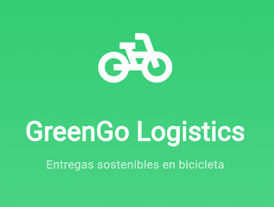

# GreenGo

## Video explicativo

[](https://www.youtube.com/shorts/zt_18OUlSeM)

haz clic en la imagen para poder la app en funcionamiento
## Descripción

**GreenGo Logistics** es una aplicación móvil diseñada para coordinar repartidores en bicicleta para entregas sostenibles en la ciudad. La app resuelve el problema real de la gestión manual de entregas, permitiendo a los repartidores reportar entregas completadas y a los supervisores monitorear el progreso en tiempo real.

## Características Principales

### Requisitos Cumplidos

- **UI Básica Profesional**: Pantallas para repartidor y supervisor con diseño moderno
- **Gestión de Estado**: Implementada con Provider para manejo eficiente de datos
- **Interacción en Tiempo Real**: Las entregas se reflejan instantáneamente al marcarlas
- **Diseño Visual Consistente**: ThemeData personalizado con colores de la marca GreenGo
- **Persistencia de Datos**: Uso de SharedPreferences para guardar el estado
- **Animaciones Fluidas**: Transiciones y efectos visuales atractivos

### Características Extras

- **Animaciones Personalizadas**:
  - Círculo de progreso animado en el panel del supervisor
  - Transiciones suaves al marcar entregas
  - Efectos de escala en las tarjetas
  
- **Estadísticas Detalladas**:
  - Porcentaje de completitud en tiempo real
  - Métricas por repartidor
  - Vista timeline de todas las entregas
  
- **Navegación por Tabs**:
  - Panel del supervisor con 3 pestañas (Resumen, Repartidores, Timeline)
  - Navegación intuitiva entre secciones
  
- **Persistencia Avanzada**:
  - Datos guardados localmente con SharedPreferences
  - Estado preservado entre sesiones
  - Opción de resetear datos para pruebas

## Estructura

```
lib/
├── main.dart                       # Punto de entrada de la aplicación
├── models/
│   └── delivery.dart              # Modelo de datos para entregas
├── providers/
│   └── delivery_provider.dart     # Gestión de estado con Provider
├── screens/
│   ├── home_screen.dart           # Pantalla de inicio
│   ├── rider_screen.dart          # Panel del repartidor
│   └── supervisor_screen.dart     # Panel del supervisor
├── theme/
│   └── app_theme.dart             # Tema personalizado de la app
└── widgets/
    ├── delivery_card.dart         # Tarjeta de entrega individual
    ├── progress_card.dart         # Tarjeta de progreso animada
    ├── rider_performance_card.dart # Rendimiento por repartidor
    └── delivery_timeline.dart     # Vista de línea de tiempo
```
